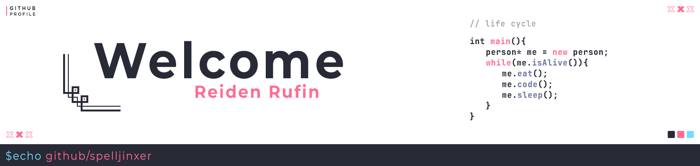

<!-- Author: Spelljinxer -->

# Hello! 👋

* 📆 20 year old uni student
* 🎓 Third-year undergrad at <a href="https://www.uwa.edu.au/">The University of Western Australia</a>
* 💻  </img>Computer Science Major
* ❤️ Anime, Manga, Games
  * 

📺 Favourite Animes

    <ul>
      <li><a href="https://anilist.co/anime/14813/My-Teen-Romantic-Comedy-SNAFU/"> Oregairu</li>
      <li><a href="https://anilist.co/anime/7791/KON-Season-2/"> K-On!!</li>
      <li><a href="https://anilist.co/anime/5081/Bakemonogatari/"> Monogatari </li></a>
    </ul>
    

  * 

📖 Favourite Mangas

    <ul>
      <li><a href="https://anilist.co/manga/105577/Giji-Harem/"> Giji Harem</li>
      <li><a href="https://anilist.co/manga/107282/Shikimoris-Not-Just-a-Cutie/"> Shikimori's Not Just a Cutie </li>
      <li><a href="https://anilist.co/manga/101177/Fly-Me-to-the-Moon/"> Tonikaku Kawaii </li>
      <li><a href="https://anilist.co/manga/112981/Kubo-Wont-Let-Me-Be-Invisible/"> Kubo Won't Let Me Be Invisible </li></a>
    </ul>
    

  * 

🎮 Favourite Games

    <ul>
      <li> Genshin Impact</li>
      <li> Honkai Impact 3 </li>
      <li> Nier Replicant / Automata</li>
      <li> Touhou Project</li>
    </ul>
    

* 💙 Programming, Graphic Design
* 🌐 <a href="https://spelljinxer.github.io/">spelljinxer.github.io</a>

# Knowledge 🧠

 <h3 align=center>🛠️Tools🛠️
   

 

👨‍💻Programming👨‍💻

 

 

# Stats 📈 

&nbsp; 
<!-- Streak API-->
<!-- -->

# Links 📤

<a href="https://www.twitch.tv/Spelljinxer"></a> </img>  

 
<!-- White for now since markdown doesnt support this gg -->
"If all you're good for is breathing in and out,

  then even an AC unit is more useful than you."
 
- 
  Yukinoshita
Yukino

