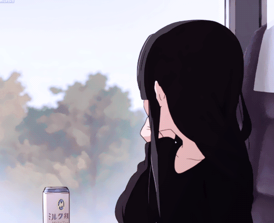

<!-- Author: Spelljinxer -->

<br>
<p align="center">
<!-- old:  01001000+01000101+01001110+01010100+01000001+01001001-->
<!-- new:  01010111+01100101+01101100+01100011+01101111+01101101+01100101-->
<!-- </img> -->
  
</p>


<div align="center">
  <a href="https://github.com/Spelljinxer/dotfiles">
    
  </a>
</div>


# Hello! 👋
<p align="center">

* 📆 24/07/02
* 🎓 BSc. Computer Science - <a href="https://www.uwa.edu.au/">The University of Western Australia</a>
</img>
* ❤️ Anime and Gaming
  * <details><summary>📺 Favourite Animes</summary>
    <ul>
      <li><a href="https://anilist.co/anime/14813/My-Teen-Romantic-Comedy-SNAFU/"> Oregairu</li>
      <li><a href="https://anilist.co/anime/7791/KON-Season-2/"> K-On!!</li>
      <li><a href="https://anilist.co/anime/5081/Bakemonogatari/"> Monogatari </li></a>
    </ul>
    </details>
  * <details><summary>🎮 Favourite Games</summary>
    <ul>
      <li> Genshin Impact</li>
      <li> Goddess of Victory: Nikke </li>
      <li> Wuthering Waves </li>
      <li> Nier Replicant / Automata</li>
      <li> Touhou Project</li>
    </ul>
    </details>
* 💙 Programming, Graphic Design
* 🌐 <a href="https://spelljinxer.github.io/">spelljinxer.github.io</a>


# Knowledge 🧠
<center>

 <h3 align=center>🛠️Tools🛠️
 <br><br>

<br>


👨‍💻Programming👨‍💻

<br>

<br></center>

# Stats 📈 
<p align="center">
&nbsp;<br>
<!-- Streak API-->

</p>

# Links 📤
<p align="center">
<a href="https://steamcommunity.com/id/spelljinxer/"></a><a href="https://open.spotify.com/user/necj33rd3m1wb5klvdjtp4z1q?si=be17277a60be486b"></a><a href="https://www.twitch.tv/Spelljinxer"><a href="https://anilist.co/user/Kyokino/"></a></a><br></img><br><br>
<br><br>
</p>
<div align="center">

```scala
"jus vibin'"
- someone, probably. idk
```
</div>
